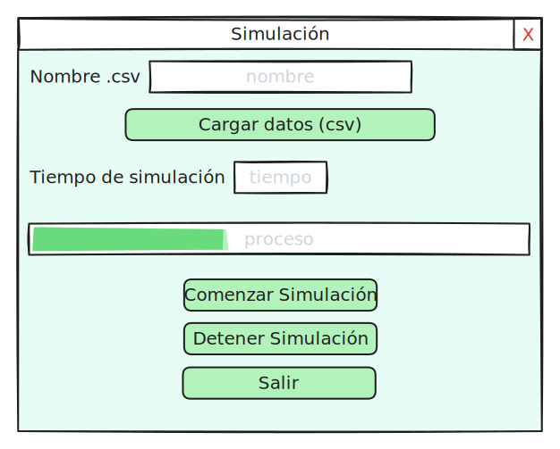

## Situación problémica
La asociación de la ventilación artificial mecánica con la mortalidad en UCI ha sido ampliamente demostrada (30–33), sin embargo, existen pocos estudios internacionales y en el país que evidencien qué ocurre cuando el paciente ventilado sale de alta de la UCI; y no existe en Cuba ningún score pronóstico cuantitativo diseñado para evaluar el riesgo de muerte de estos pacientes que complemente la toma de decisiones relativas al egreso en UCI, aspectos estos que es necesario conocer en este medio y que pueden ser de importancia nacional e internacional.

## Objetivo
Construir un score pronóstico implementado computacionalmente como predictor de la supervivencia intrahospitalaria post egreso de UCI en los pacientes ventilados por 24 horas o más en Terapia Intensiva.
