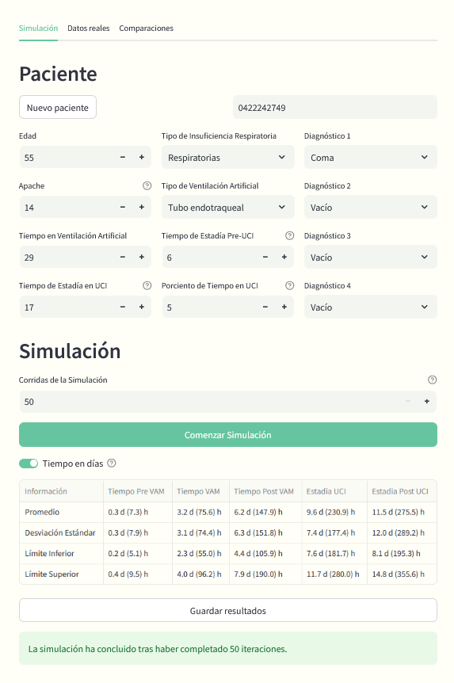
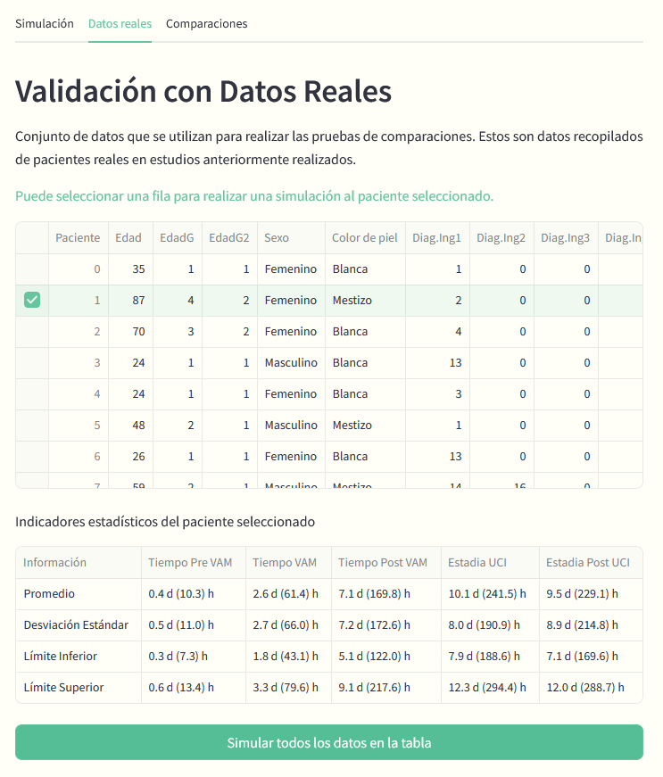

# Información sobre el Proyecto

## Aplicación para la simulación de la evolución pos-egreso para pacientes ventilados en Cuidados Intensivos

## Introducción

La simulación de eventos de la vida real permite realizar predicciones estadísticas que son cruciales para mejorar la
toma de decisiones en el ámbito de la salud. En unidades de cuidados intensivos, este enfoque proporciona al personal
médico una herramienta poderosa para comprender mejor las variables que afectan el pronóstico de los pacientes,
optimizando así la atención y los recursos disponibles.

## Descripción situación problémica

La dificultad para predecir con precisión el tiempo de estancia en la Unidad de Cuidados Intensivos (UCI) de los
pacientes que requieren ventilación artificial, así como su posterior pronóstico de supervivencia o alta hospitalaria,
ocasiona un nivel de incertidumbre que afecta la planificación y gestión de recursos dentro de la UCI, además de
complicar la toma de decisiones clínicas.

## Objetivo general

Se requiere una herramienta que pueda proporcionar predicciones estadísticas basadas en datos clínicos y características
de salud de los pacientes utilizando un modelo de simulación, con el fin de mejorar la atención y los resultados
médicos.

## Objetivos específicos

### Simulación de Pacientes en UCI

Desarrollar un sistema de simulación que modele el comportamiento de pacientes ingresados en la UCI, considerando su
tiempo de estancia y necesidad de ventilación artificial.

### Análisis Estadístico de Resultados

Implementar herramientas de análisis estadístico que proporcionen, al personal médico, datos sobre tiempos promedio de
estancia en la UCI, probabilidad de supervivencia y otros indicadores clave. Estos resultados deben permitir comparar la
evolución de un paciente con otros datos clínicos similares utilizando distribuciones estadísticas y métodos de
agrupamiento.

### Validación de Modelos Predictivos

Desarrollar funcionalidades para validar modelos predictivos de pronóstico de supervivencia basados en datos históricos.
Esto incluye la comparación entre diferentes modelos de simulación y la posibilidad de ajustar parámetros para realizar
experimentos específicos con nuevos pacientes.

### Interfaz de Usuario Intuitiva

Crear una interfaz de usuario amigable, que permita a los médicos introducir datos clínicos, configurar simulaciones y
visualizar los resultados de manera clara y comprensible. La interfaz tiene el rol de facilitar la comparación de
diferentes escenarios de tratamiento y la evolución de pacientes en la UCI.

### Exportación y Almacenamiento de Resultados

Implementar la capacidad de guardar los resultados de las simulaciones, incluidos los parámetros de entrada y los
resultados obtenidos, en formatos como CSV para su posterior análisis y validación con datos reales.

## Tecnología empleada

### Recursos open-source

Este proyecto se realiza en Python como lenguaje de programación principal. En el estado actual de desarrollo se
utilizan recursos open-source y frameworks de Python entre los que se destacan:

- **Simpy**: Biblioteca de simulación de eventos que permite crear modelos de simulación y realizar simulaciones de
  eventos en tiempo real.
- **Streamlit**: Biblioteca de visualización de datos que permite crear gráficos y gráficos de barras para visualizar
  resultados.
- **Pandas**, **NumPy**, **Matplotlib**: Bibliotecas de análisis de datos que permite manipular y analizar datos en
  formato tabular.

### Herramientas de Control de Versiones

- **Git**: Sistema de control de versiones distribuido que permite gestionar el código fuente de una aplicación y su
  historial de cambios.

## Imágenes




___


Los requisitos mínimos son Python v3.9 o superior.
En la ruta raíz del proyecto existe un archivo `requirements.txt` con las dependencias básicas de Frameworks que
necesita el proyecto para su funcionamiento.
Hasta el momento:

- Streamlit
- Scipy
- Simpy

Y otras bibliotecas como:

- Numpy
- Pandas

## Despliegue

Este proyecto está desplegado hasta la fecha en Streamlit Community Cloud. Se puede acceder a través de la siguiente dirección:

- https://simuci-v0.streamlit.app/

## **Importante**

Para los usuarios cubanos, es necesario el uso de VPN para el acceso a la plataforma, debido a las políticas que exige Streamlit:
> Error: Forbidden.
> Your client does not have permission to get URL / from this server.

## Corrida de la aplicación vía Script.

Para correr la aplicación de manera local se utiliza el comando

```commandline
streamlit run app.py
```

- Siendo `app.py` el módulo que gestiona la interfaz gráfica y llama funciones de los controladores de datos en el
  backend.

*El comando debe ejecutarse desde la raíz del proyecto.*
